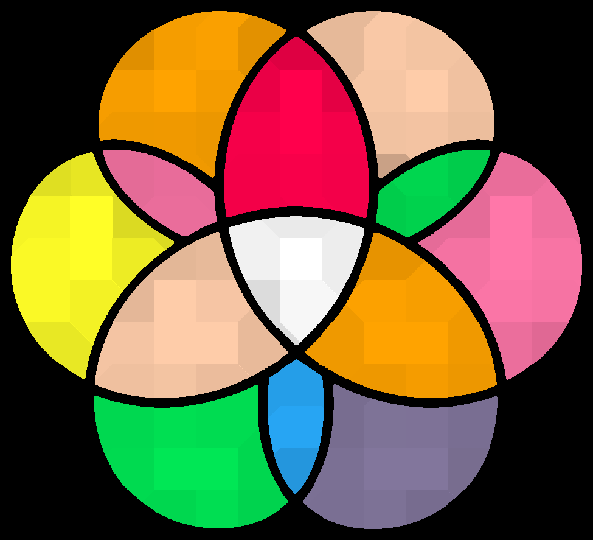

<h1 align="center">
  <br>
  </a>
  <br>
  PICO-8 Gym
  <br>
</h1>

<h4 align="center">A PICO-8 Reinforcement Learning Environment based on <a href="https://gymnasium.farama.org/" target="_blank">Gymnasium</a>.</h4>

<!-- <p align="center">
  <a href="https://badge.fury.io/js/electron-markdownify">
    
  </a>
  <a href="https://gitter.im/amitmerchant1990/electron-markdownify"></a>
  <a href="https://saythanks.io/to/bullredeyes@gmail.com">
      
  </a>
  <a href="https://www.paypal.me/AmitMerchant">
    
  </a>
</p> -->

<p align="center">
  <a href="#key-features">Key Features</a> •
  <a href="#how-to-use">How To Use</a> •
  <a href="#websocket-communications">Websocket Communications</a> •
  <a href="#credits">Credits</a> •
  <a href="#contribute">Contribute</a> •
  <a href="#license">License</a>
</p>

<!--  -->

## Key Features

* Implements Gymnasium interface
  - Actively maintained fork of OpenAI's Gym
* Compatible with recent releases of Stable Baselines 3
* Multi-process communication with Node.js PICO-8 environments
  - Uses websockets to communicate
* Supports parallelism
* Several display modes

## How To Use

To clone and run this application, you'll need all of the dependencies of [PICO-Node](https://github.com/Jeffjewett27/PICO-Node) installed.

```bash
# Clone this repository
$ git clone --recurse-submodules --remote-submodules https://github.com/Jeffjewett27/PICO-Gym.git

# Go into the repository
$ cd PICO-Gym

# Install dependencies
$ conda env create -f environment.yml
$ conda active picogym

# Install submodule dependencies
$ cd PICO-Node
$ npm install
$ cd ..

# Run an agent
$ python agents/cartpole.py
```

<!-- > **Note**
> If you're using Linux Bash for Windows, [see this guide](https://www.howtogeek.com/261575/how-to-run-graphical-linux-desktop-applications-from-windows-10s-bash-shell/) or use `node` from the command prompt. -->


## Websocket Communications

### From Client

- Console Initialized

```
{
    'event': 'init'
}
```

- Reset Confirmed

```
{
    'event': 'reset'
}
```

- Step Response

```
{
    'event': 'step',
    'step': $INT,
    'screen': '$BASE64_IMG_STRING',
    'reward': $FLOAT,
    'terminated': $BOOL,
    'truncated': $BOOL,
    **other key-value pair
}
```

### From Server

- Reset Stage

```
{
    'commands': [
        {
            'type': 'reset',
            'seed': $INT,
            **options
        }
    ]
}
```

- Step Input

```
{
    'step': $INT,
    'input': $INT | [$INT, ...], //player 1 or multiple players
    'commands': [
        {
            'type': '$COMMAND_TYPE',
            **options
        }
    ]
}
```

## Credits


- [PICO-Node](https://github.com/Jeffjewett27/PICO-Node) (JeffJewett27)
- [Gymnasium](https://gymnasium.farama.org/) (Farama)
- [Stable Baselines 3](https://github.com/DLR-RM/stable-baselines3) (DLR-RM)

## Contribute

Contributions to the project are welcome. If there is interest, I can set up communication channels.

<!-- <a href="https://www.buymeacoffee.com/5Zn8Xh3l9" target="_blank"></a>

<p>Or</p> 

<a href="https://www.patreon.com/amitmerchant">
	
</a>

## You may also like...

- [Pomolectron](https://github.com/amitmerchant1990/pomolectron) - A pomodoro app
- [Correo](https://github.com/amitmerchant1990/correo) - A menubar/taskbar Gmail App for Windows and macOS -->

## License

MIT

---

<!-- > [amitmerchant.com](https://www.amitmerchant.com) &nbsp;&middot;&nbsp; -->
GitHub [@JeffJewett27](https://github.com/JeffJewett27) <!-- &nbsp;&middot;&nbsp; -->
<!-- > Twitter [@amit_merchant](https://twitter.com/amit_merchant) -->

